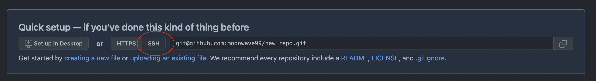

# My first repo

Here I will do some work

```
touch README.md
code . (and save in the editor)

git status (observe the output)

On branch main

No commits yet

Untracked files:
  (use "git add <file>..." to include in what will be committed)
	README.md
```

```
git add README.md

git status
```

```
On branch main

No commits yet

Changes to be committed:
  (use "git rm --cached <file>..." to unstage)
	new file:   README.md
```

```
git commit -m 'Add README.md to my repo'

[main (root-commit) c4df294] Add README.md to the repo
 1 file changed, 3 insertions(+)
 create mode 100644 README.md
```

```
git status

On branch main
nothing to commit, working tree clean
```

## Fix the HTTPS vs SSH problem

Open the git config in the editor:

```
code .git/config
```

Remove the final part:

```
[remote "origin"]
	url = https://github.com/xxxxx/my_first_repo
	fetch = +refs/heads/*:refs/remotes/origin/*
```

Copy the updated info from git and paste it into the terminal:



## More info

blabla